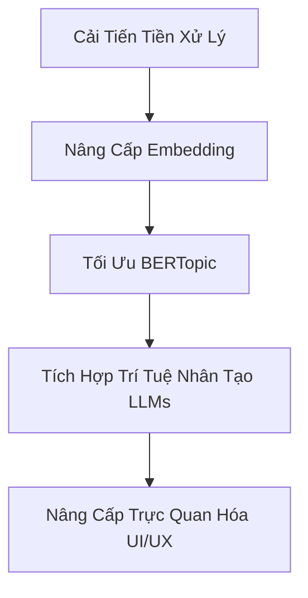

# Đề Xuất Phương Án Cải Tiến & Nâng Cấp Hệ Thống
**Đề tài:** Phân Cụm Chủ Đề Văn Bản Tiếng Việt  
**MSSV:** 123000882  

Dựa trên kết quả thực nghiệm huấn luyện trên 67.711 văn bản và kiểm thử trên 140 bài viết VietnamNet, dưới đây là các giải pháp cụ thể giúp nâng cao độ chính xác, khả năng mở rộng và trải nghiệm người dùng của hệ thống.

---

## 🗺️ Bản Đồ Lộ Trình Cải Tiến (Roadmap)



---

## 🛠️ 1. Cải Tiến Dữ Liệu & Tiền Xử Lý (Data & Preprocessing)

Hiện tại, quá trình tiền xử lý chỉ lọc danh sách stopwords thủ công đơn giản và giữ lại toàn bộ các từ sau khi lọc. Ta có thể cải tiến như sau:

*   **Lọc từ loại (Part-of-Speech Filtering):**
    *   *Phương án:* Chỉ giữ lại Danh từ (Noun), Động từ (Verb) và Tính từ (Adjective) vì các từ này mang nhiều thông tin về chủ đề nhất. Loại bỏ Giới từ, Liên từ, Trợ từ, v.v. bằng công cụ Gán nhãn từ loại (POS Tagging) của `underthesea`.
    *   *Mục tiêu:* Giảm nhiễu từ khóa đặc trưng c-TF-IDF và tăng chỉ số Coherence.
*   **Mở rộng bộ từ dừng (Stopwords Dictionary):**
    *   *Phương án:* Tích hợp bộ từ dừng tiếng Việt đầy đủ hơn (khoảng 2.000 từ thông dụng từ các nguồn công khai) thay vì danh sách 80 từ hiện tại.
*   **Ẩn danh/Mã hóa thực thể (Named Entity Masking):**
    *   *Phương án:* Nhận diện và loại bỏ/mã hóa các thực thể tên người riêng (e.g. Nguyễn Văn A), địa danh nhỏ (e.g. ngõ X, đường Y) để tránh làm lệch phân cụm do các từ riêng lẻ xuất hiện đột ngột.

---

## 🧠 2. Nâng Cấp Vector Embedding (Embedding Models)

Mô hình hiện tại `paraphrase-multilingual-MiniLM-L12-v2` chỉ nặng 120MB, chạy nhanh nhưng là mô hình đa ngôn ngữ tổng quát nên chưa tối ưu hoàn toàn cho ngữ nghĩa tiếng Việt chuyên sâu.

*   **Sử dụng PhoBERT chuyên biệt cho tiếng Việt:**
    *   *Phương án:* Thay thế bằng `vinai/phobert-base` hoặc `vinai/phobert-large` kết hợp kỹ thuật lấy trung bình vector trạng thái ẩn (Mean Pooling).
    *   *Mục tiêu:* Nắm bắt ngữ cảnh tiếng Việt tốt hơn, đặc biệt là các thành ngữ, từ ghép phức tạp.
*   **Sử dụng mô hình đa ngôn ngữ mạnh hơn:**
    *   *Phương án:* Sử dụng `sentence-transformers/LaBSE` (Language-Agnostic BERT Sentence Embedding) hoặc `cohere.embed-multilingual-v3.0` (thông qua API).

---

## 🎯 3. Tối Ưu Hóa & Nâng Cấp BERTopic

HDBSCAN là mô hình phân cụm mật độ tuyệt vời cho tập huấn luyện, nhưng nhược điểm lớn nhất của nó là **gán quá nhiều điểm ngoại lai là `-1` (outliers) trên dữ liệu kiểm thử mới**.

*   **Xử lý Outlier triệt để (Outlier Reduction):**
    *   *Phương án:* Áp dụng tính năng giảm thiểu outlier tích hợp sẵn trong BERTopic sau khi phân cụm:
        ```python
        # Gán nhãn cho các điểm -1 dựa trên độ tương đồng c-TF-IDF hoặc vector embedding
        new_topics = topic_model.reduce_outliers(docs, topics, strategy="c-tf-idf")
        # Hoặc dùng xác suất phân bổ cụm
        new_topics = topic_model.reduce_outliers(docs, topics, strategy="probabilities", threshold=0.05)
        ```
    *   *Mục tiêu:* Triệt tiêu hoàn toàn cụm nhiễu `-1` trên tập test và phân phối bài viết vào các chủ đề chính một cách mượt mà.
*   **Guided BERTopic (Phân cụm có định hướng):**
    *   *Phương án:* Định nghĩa trước các từ khóa gợi ý (Seed Words) cho các chuyên mục mục tiêu (e.g. Thể thao: bóng đá, V-League, vô địch; Kinh doanh: doanh nghiệp, cổ phiếu, bất động sản).
        ```python
        seed_topic_list = [
            ["bóng_đá", "vô_địch", "trận_đấu", "v_league", "cầu_thủ"],
            ["doanh_nghiệp", "cổ_phiếu", "thị_trường", "doanh_thu", "lợi_nhuận"],
            ["du_lịch", "tour", "khách_sạn", "điểm_đến", "hành_trình"],
            # ...
        ]
        topic_model = BERTopic(seeded_topics=seed_topic_list)
        ```
    *   *Mục tiêu:* Hướng dẫn mô hình tìm đúng các cụm chủ đề mong muốn từ đầu, giúp tăng tính khớp nối với phân loại gốc.
*   **Mô hình hóa chủ đề theo thời gian (Dynamic Topic Modeling - DTM):**
    *   *Phương án:* Theo dõi sự biến đổi từ khóa của từng chủ đề qua thời gian bằng thuật toán `topics_over_time` tích hợp trong BERTopic để vẽ biểu đồ sự dịch chuyển mối quan tâm của công chúng.

---

## 🤖 4. Tích Hợp GenAI / LLM để Gán Nhãn Tự Động

Hiện tại, tên chủ đề được sinh tự động bằng c-TF-IDF có dạng: `0_một_không_hai_người` hoặc `2_đồng_một_không_tháng` rất khó hiểu đối với người dùng cuối.

*   **Giải pháp tự động đặt tên chủ đề bằng LLM:**
    *   *Phương án:* Tích hợp thư viện `Representation` của BERTopic kết hợp với API miễn phí hoặc cục bộ (e.g. Google Gemini API, OpenAI GPT-4o-mini hoặc Llama-3 qua Ollama).
        ```python
        from bertopic.representation import Gemini
        import google.generativeai as genai

        # Khởi tạo mô hình Gemini
        representation_model = Gemini(model="gemini-1.5-flash", delay_in_seconds=2)
        
        # Đưa vào cấu hình BERTopic
        topic_model = BERTopic(representation_model=representation_model)
        ```
    *   *Kết quả:* LLM sẽ đọc top-10 từ khóa và các bài viết tiêu biểu nhất của từng cụm, sau đó tự đặt tên chủ đề rất tự nhiên như: *"📈 Thị trường tài chính & Chứng khoán"*, *"⚽ Các giải đấu bóng đá trong nước"*, v.v.

---

## 💻 5. Nâng Cấp Giao Diện & Tính Năng Trực Quan Hóa (UI/UX)

*   **Sử Phân Cụm Phân Cấp (Hierarchical Clustering Tree):**
    *   *Phương án:* Thêm biểu đồ cây phân cấp (Dendrogram) để thể hiện mối quan hệ họ hàng giữa các chủ đề siêu nhỏ (micro-topics) ghép thành chủ đề lớn (macro-topics).
*   **Phân tích Cảm Xúc theo Chủ Đề (Topic Sentiment Analysis):**
    *   *Phương án:* Tích hợp thêm một mô hình phân tích cảm xúc (Sentiment Analysis) nhỏ để đo lường xem thái độ của các bài viết trong từng chủ đề là Tích cực, Tiêu cực hay Trung lập (e.g. Chủ đề "Pháp luật" thường mang màu sắc tiêu cực, "Thể thao" mang màu sắc tích cực).
*   **Tích hợp Công Cụ Tìm Kiếm Ngữ Nghĩa (Semantic Search Engine):**
    *   *Phương án:* Thay vì chỉ tìm kiếm từ khóa thô, người dùng nhập câu hỏi hoặc ý tưởng dài (e.g. "tình hình kinh tế phục hồi sau đại dịch"), hệ thống sử dụng SBERT tìm kiếm các văn bản có khoảng cách Cosine gần nhất trong toàn bộ 67.000 bài viết. Tích hợp thư viện **FAISS** để tăng tốc tìm kiếm vector dưới 10ms.
